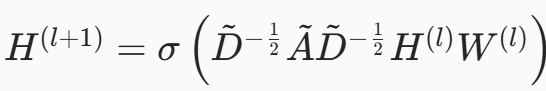
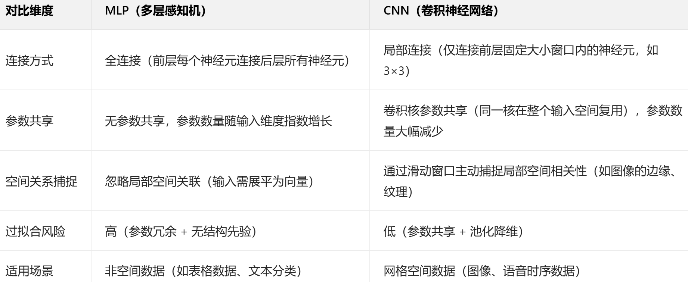
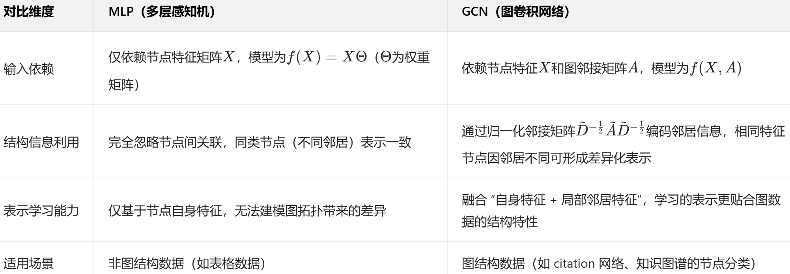
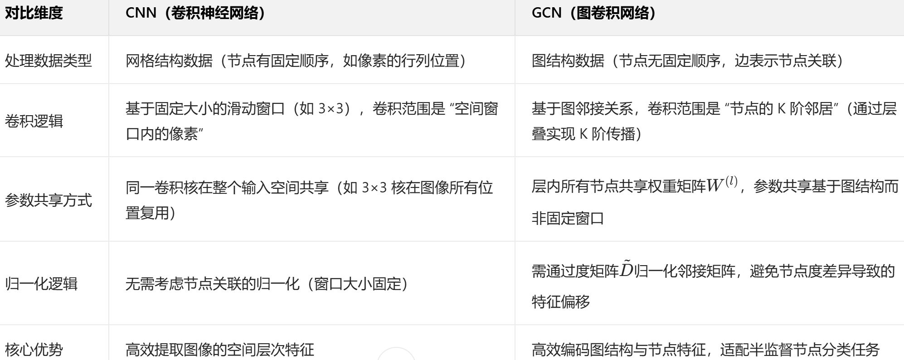
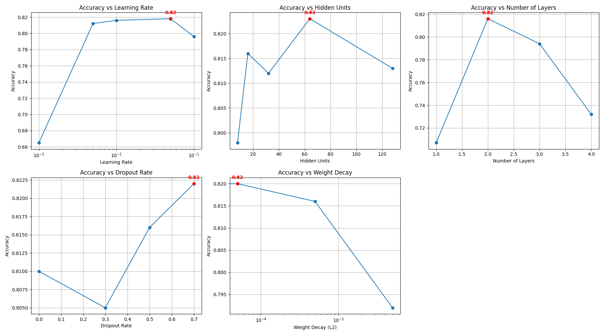
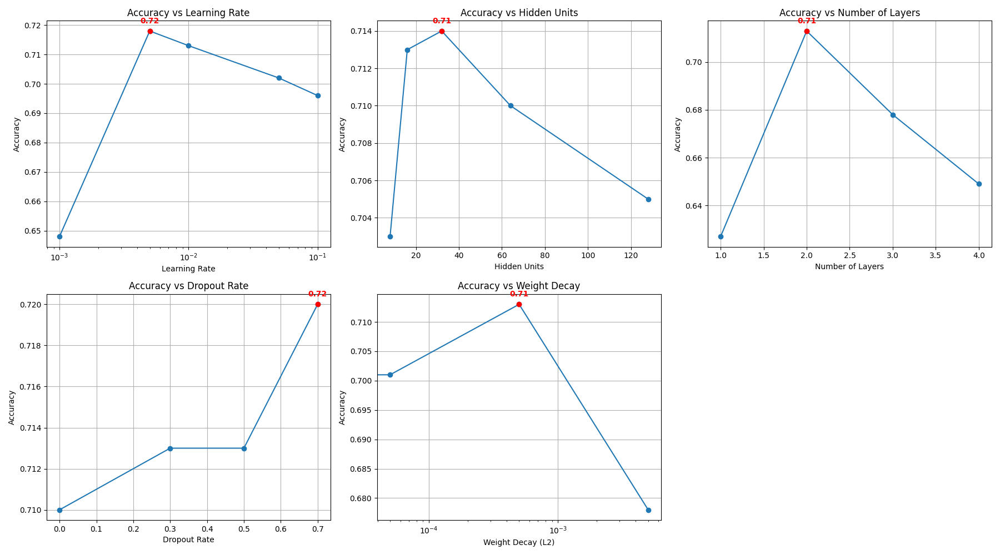

# GCN复现实验任务

---

## 1. GCN是如何工作的？

图卷积神经网络（GCN）的工作原理主要基于层间的传播规则，通过特征传递来实现对图结构数据的处理：

  
  
<em>图1：GCN中的特征传递规则公式</em>

---

## 2. 在CV领域，什么是CNN？CNN与MLP的区别在哪儿？

### 2.1 什么是CNN

卷积神经网络（CNN）是专为网格结构数据（如图像、语音）设计的深度学习模型，其核心流程包括：
- 卷积层提取局部特征
- 池化层进行降维处理
- 全连接层完成分类任务

通过这一流程，CNN能够逐步将底层像素特征抽象为高层语义特征（如边缘、纹理、物体部件），广泛应用于图像分类、目标检测、图像分割等计算机视觉（CV）任务。

### 2.2 CNN与MLP的区别

  
  
<em>表2：多层感知器（MLP）与卷积神经网络（CNN）的对比</em>

---

## 3. GCN与其他神经网络的区别

### 3.1 GCN与MLP的区别

  
  
<em>表3：多层感知器（MLP）与图卷积神经网络（GCN）的对比</em>

### 3.2 GCN与CNN的区别

  
  
<em>表4：图卷积神经网络（GCN）与卷积神经网络（CNN）的对比</em>

---

## 4. 数据集上的节点分类任务准确率

### 4.1 Cora数据集上的节点分类任务准确率

  
  
<em>图5：Cora数据集上的节点分类任务准确率</em>

### 4.2 Citeseer数据集上的节点分类任务准确率

  
  
<em>图6：Citeseer数据集上的节点分类任务准确率</em>

